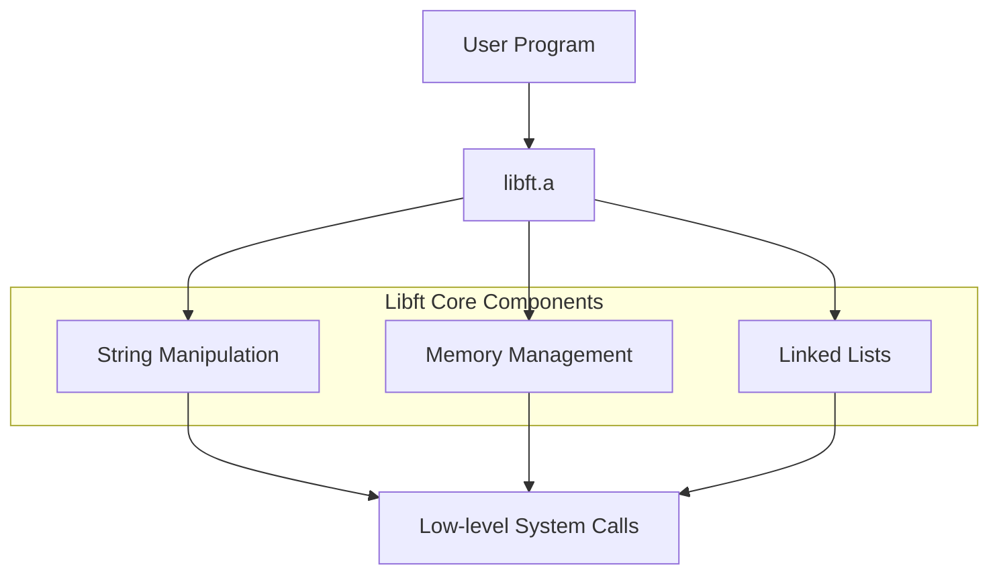

#  Libft - My Own C Library
  
📌 **42 School - Core Curriculum Project**  

## ▌ Description
Libft is my first custom C library. This project allowed me to reimplement essential **libc** functions, as well as add utility functions for handling strings, memory, and linked lists.
<!--  -->




## ▌ Objectives
▸ Understand and reimplement essential **libc** functions  
▸ Master memory management and avoid leaks  
▸ Follow the **C norm** and strict compilation rules (`-Wall -Wextra -Werror`)  
▸ Implement **linked list handling** as a bonus  

## ▌ Result: **125% with Bonus**
I successfully completed all mandatory parts and **bonus functions**, achieving a perfect **125%** score 🎉.

## ▌ Files
- `libft.h` → Contains function prototypes and structure definitions  
- `libft.a` → Static library archive (generated by `make`)  
- `Makefile` → Automates compilation (`all`, `clean`, `fclean`, `re`, `bonus`)  

## ▌ Implemented Functions
### ■ **Mandatory Part**
| Category         | Functions |
|------------------|----------------|
| ▸ **Char & String** | `ft_isalpha` `ft_isdigit` `ft_isalnum` `ft_isascii` `ft_isprint` `ft_strlen` `ft_strdup` `ft_strlcpy` `ft_strlcat` `ft_strchr` `ft_strrchr` `ft_strncmp` `ft_strnstr` |
| ▸ **Memory** | `ft_memset` `ft_bzero` `ft_memcpy` `ft_memmove` `ft_memchr` `ft_memcmp` `ft_calloc` |
| ▸ **Conversions** | `ft_atoi` `ft_toupper` `ft_tolower` |
| ▸ **String Manipulation** | `ft_substr` `ft_strjoin` `ft_strtrim` `ft_split` `ft_itoa` `ft_strmapi` `ft_striteri` |
| ▸ **Output** | `ft_putchar_fd` `ft_putstr_fd` `ft_putendl_fd` `ft_putnbr_fd` |

### ■ **Bonus (Linked Lists)**
| Function | Description |
|----------|-------------|
| `ft_lstnew` | Creates a new list node |
| `ft_lstadd_front` | Adds a node to the beginning of the list |
| `ft_lstsize` | Counts the number of nodes |
| `ft_lstlast` | Returns the last node of the list |
| `ft_lstadd_back` | Adds a node to the end of the list |
| `ft_lstdelone` | Deletes a single node and frees memory |
| `ft_lstclear` | Deletes and frees the entire list |
| `ft_lstiter` | Applies a function to each node |
| `ft_lstmap` | Creates a new list by applying a function to each node |

## ▌ Installation & Usage
1️⃣ **Clone the repository**  
```sh
git clone https://github.com/ai-dg/libft.git
cd libft
```

2️⃣ Compile the library
```sh
make
```

3️⃣ Use Libft in another project

Include the header and link libft.a:
```c
#include "libft.h"

int main() {
    char *str = ft_strdup("Hello, Libft!");
    printf("%s\n", str);
    free(str);
    return 0;
}
```

Compile with:
```sh
gcc main.c -Wall -Wextra -Werror -L. -lft -o my_program
./my_program
```
## 📜 License

This project was completed as part of the **42 School** curriculum.  
It is intended for **academic purposes only** and follows the evaluation requirements set by 42.  

Unauthorized public sharing or direct copying for **grading purposes** is discouraged.  
If you wish to use or study this code, please ensure it complies with **your school's policies**.  

